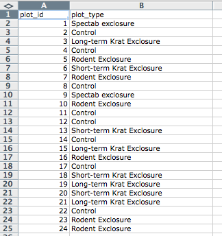
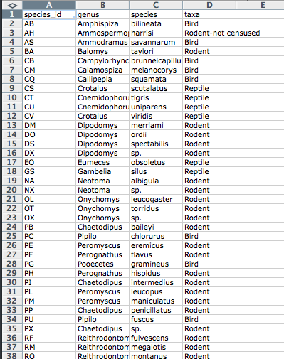

Authors: **Christie Bahlai**, **Aleksandra Pawlik** 
Contributors: **Jennifer Bryan**, **Alexander Duryee**, **Jeffrey Hollister**, **Daisie Huang**, **Owen Jones**,
**Ben Marwick** and **Sebastian Kupny**.

## Learning Objectives
* Learning best practices for recording and formatting data in spreadsheets
* Understanding the correspondence between columns and rows in spreadsheets
and data structure
* Understanding the correspondence between spreadsheet cells, columns and rows
and data observations and values

The most common mistake made is treating the
program like it is a lab notebook- that is, relying on context, notes in the
margin, spatial layout of data and fields to convey information. As humans,
we can (usually) interpret these things, but computers are dumb, and unless
we explain to the computer what every single thing means, it will not be able
to see how our data fit together.

Using the power of computers, we can manage and analyze data in much more
effective and faster ways, but to use that power, we have to set up
our data for the computer to be able to understand it (and computers are very
literal).

This is why it’s extremely important to set up well-formatted tables from the
outset- before you even start entering data from your very first preliminary
experiment. **Data organization is the foundation of your research project.**
It can make it easier or harder to work with your data throughout your
analysis, so it's worth thinking about when you're doing your data
entry or setting up your experiment. You can set things up in a different
way in spreadsheets, but it limits your ability to work with the data
in other programs or have the you-of-6-months-from-now or your collaborator
work with the data.

###Structuring data in spreadsheets

There are two rules you should keep in mind when entering your data
into any spreadsheet:

1. Each data cell is an observation that must have all the relevant information
connected to it for it to stand on its own.

2. You must make it clear to the computer how the data cells relate to the
relevant information and each other.

So, you can see how these two points apply directly to how you set up your
spreadsheets.

###Columns for variables and rows for observations

The rule of thumb, when setting up a datasheet, is columns= variables,
rows = observations, cells=data (values).
Let's try this with an example using some of our sample data: [a list of
species](../../../data/biology/species.csv) and
[a list of plots](../../../data/biology/plots.csv).
You can do that by simply opening the `*.csv` files in Excel. Excel will
automatically try to fit the data from the `*.csv` file and put the first
value in column A and the second value in column B.

The output should look like this:

### Exercise

Two graduate students went out and collected data in 1977, 1978 and 1979. They
gave their data	to their advisor who put it in separate tabs in
the same spreadsheet.

- Create a folder datacarpentry

- Go in to that folder, and create two folders 'raw-data' and 'analysis-data'

- Download the spreadsheet from [survey_data_tabs.xls](survey_data_tabs.xls)  
When you go to the link the data should just download

- Put this file in the 'raw-data' folder

- Open the file

- Using the survey_data_tab.xls spreadsheet in the 1977 tab, identify the
things that would make it hard for a computer to understand

- Create a new spreadsheet with the data that fixes those problems. Document
what you did to fix it in a text file called README-1977, and save that new spreadsheet
and text file in the 'analysis-data' folder.

Previous: [Introduction](00-intro.html)  Next: [Common formatting mistakes](02-common-mistakes.html)
