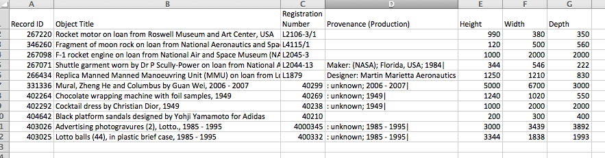

Authors: **Christie Bahlai**, **Aleksandra Pawlik** 
Contributors: **Jennifer Bryan**, **Alexander Duryee**, **Jeffrey Hollister**, **Daisie Huang**, **Owen Jones**,
**Ben Marwick** and **Sebastian Kupny**.

## Learning Objectives
* Learning best practices for recording and formatting data in spreadsheets
* Understanding the correspondence between columns and rows in spreadsheets
and data structure
* Understanding the correspondence between spreadsheet cells, columns and rows
and data observations and values

The most common mistake made is treating the
program like it is a lab notebook- that is, relying on context, notes in the
margin, spatial layout of data and fields to convey information. As humans,
we can (usually) interpret these things, but computers are dumb, and unless
we explain to the computer what every single thing means, it will not be able
to see how our data fit together.

Using the power of computers, we can manage and analyze data in much more
effective and faster ways, but to use that power, we have to set up
our data for the computer to be able to understand it (and computers are very
literal).

This is why it’s extremely important to set up well-formatted tables from the
outset- before you even start entering data from your very first preliminary
experiment. **Data organization is the foundation of your research project.**
It can make it easier or harder to work with your data throughout your
analysis, so it's worth thinking about when you're doing your data
entry or setting up your experiment. You can set things up in a different
way in spreadsheets, but it limits your ability to work with the data
in other programs or have the you-of-6-months-from-now or your collaborator
work with the data.

###Structuring data in spreadsheets

There are two rules you should keep in mind when entering your data
into any spreadsheet:

1. Each data cell is an observation that must have all the relevant information
connected to it for it to stand on its own.

2. You must make it clear to the computer how the data cells relate to the
relevant information and each other.

For instance we have data from the Sydney museum on all the objects in
its collection. They keep track of things like the object's name,
registration ID, provenance and size.

[http://www.powerhousemuseum.com/collection/database/download.php](http://www.powerhousemuseum.com/collection/database/download.php)

If they were to store the data about the object's size like this

the problem is that height, width and depth are all in one field. So, if
wanted to look for an object to put in a new area of the museum that's less
than 1200mm wide, we would have a hard time searching the data to find this.
If instead we put height, width and depth in different columns, you can see
that it would be much easier.

So, you can see how these points apply directly to how you set up your
spreadsheets.

###Columns for variables and rows for observations

The rule of thumb, when setting up a datasheet, is columns= variables,
rows = observations, cells=data (values).

So, instead we should have

### Exercise

We're going to take a messy version of the Syndney museum collection data
and clean it up.

- Download the data by clicking on the file:  
[phm-collection-messy.xls](phm-collection-messy.xls)

- Open up the data in a spreadsheet program

- You can see that there are two tabs. Two curators logged the objects, one in the 1990s and one in the 2000s and they both kept track of the data in their own way. Now you're the new curator and you've been handed this information, and the museum director wants statistics on the number of each type of object in the collection and when they were acquired.

- With the person next to you, work on the messy data to clean it up so
that a computer will be able to understand it.

After you go through this exercise, we'll discuss as a group what you think was wrong with this data organization and how you fixed it.  

Previous: [Introduction](00-intro.html)  Next: [Common formatting mistakes](02-common-mistakes.html)
